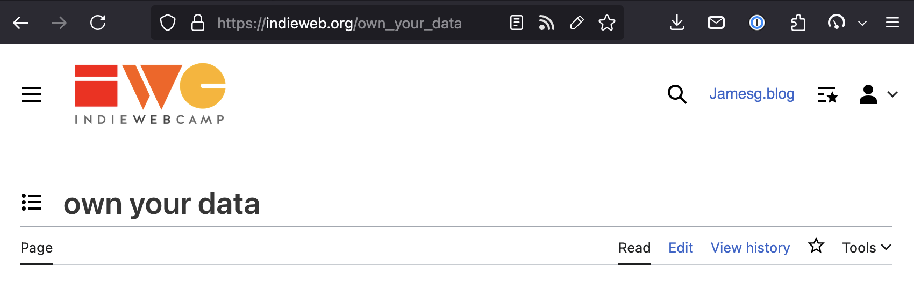

# Edit Button Browser Extension

A browser extension that adds an edit button the URL bar when a page is editable.

The following algorithm is used to determine if a page is editable:

1. Is there a [rel=edit](microformats.org/wiki/rel-edit) link on the page? If so, choose the `href` as the edit link to show the user.
2. Is there a `rel=alternate type=application/x-wiki` `link` tag on the page? If so, choose the `href` as the page edit link.
3. Are there any links with an anchor text that would indicate a page is editable, like "Edit this page"? If so, choose the first anchor whose text indicates a page is editable. (This step is opt-in in the extension settings0.

## Install

The Edit Button browser extension is available on:

- [Firefox](https://addons.mozilla.org/en-US/firefox/addon/edit-button-rel/)

Review is pending on:

- Chrome
- Edge

Safari support is in development.

## Example

## License

This project is licensed under the [MIT License](LICENSE).

## Supported Sites

The following sites have been tested and work well with the Edit Button Browser Extension, in alphabetical order by primary domain:
* https://wiki.csswg.org/
* https://indieweb.org/
* https://microformats.org/wiki/
* https://wiki.mozilla.org/
* https://www.w3.org/wiki/
* https://wiki.whatwg.org/
* https://www.wikipedia.org/

## Contributing

Contributions are welcome! Please open an issue or submit a pull request.
